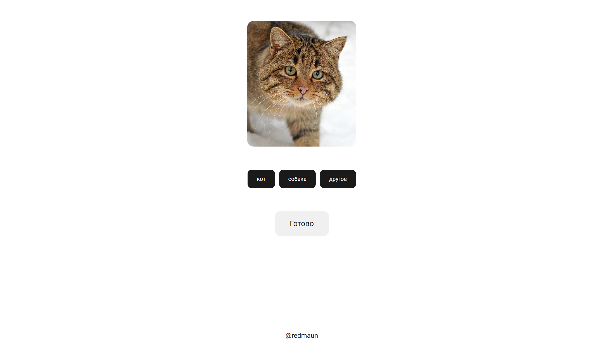

# neiro-sort
Сайт для сортировки фотографий

Зависимости:
- nodejs
- python

## Как использовать?
1. находясь в директории проекта выполнить `npm i`
2. Запустить скрипт инициализации `python init.py`
3. После указания категорий сортировки в скрипте, добавить картинки в `%САЙТ%/public/data`

Теперь сайт готов к использованию. Отсортированные картинки находятся в `%САЙТ%/sort` 

Нажатием кнопки от 1 до 9 выбирает соответствующую по счету категорию, нажатием на enter нажимает кнопку 'Готово'
